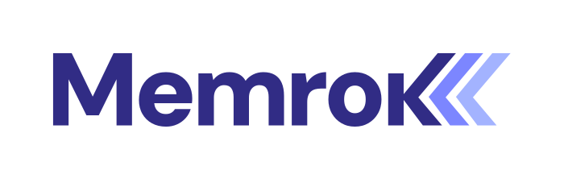

<p align="center">
  
</p>

<p align="center"><em>The part of your agent who knows you, itself, and what you built together.</em></p>

---

Memrok is a local daemon that curates structured memory across three layers — user, agent, and collaboration — using a small "scribe" model. It reads conversation transcripts and ambient signals, maintains knowledge graphs, and injects relevant context into every LLM call.

**Not** a replacement for RAG or existing memory systems. Memrok is the *curator* — it reasons about what matters, what changed, and what to surface next.

## Status

Early architecture phase. See [`docs/architecture.md`](docs/architecture.md) for the full design.

## Design Principles

- **Data rests locally, reasoning happens anywhere.** Memory data stays on-device. The scribe model can be local or remote.
- **Model-agnostic.** Memory survives main model swaps. The scribe itself is swappable.
- **Event-driven.** Consolidation triggers are biological, not cron-based.
- **Self-tuning.** Relevance weights adapt based on observed user-agent interaction patterns.
- **OpenClaw-native, protocol-portable.** Primary integration via OpenClaw. MCP as secondary surface.

## Monorepo Structure

```
packages/
├── daemon/           → memrokd (watcher + consolidation engine + API)
├── scribe/           → scribe protocol (system prompt + model interface)
├── store/            → graph storage (SQLite + vector index + append-only log)
├── injector/         → context assembly + relevance scoring
└── openclaw-plugin/  → OpenClaw context engine wrapper
```

## License

MIT
